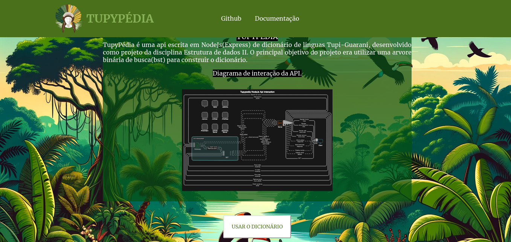
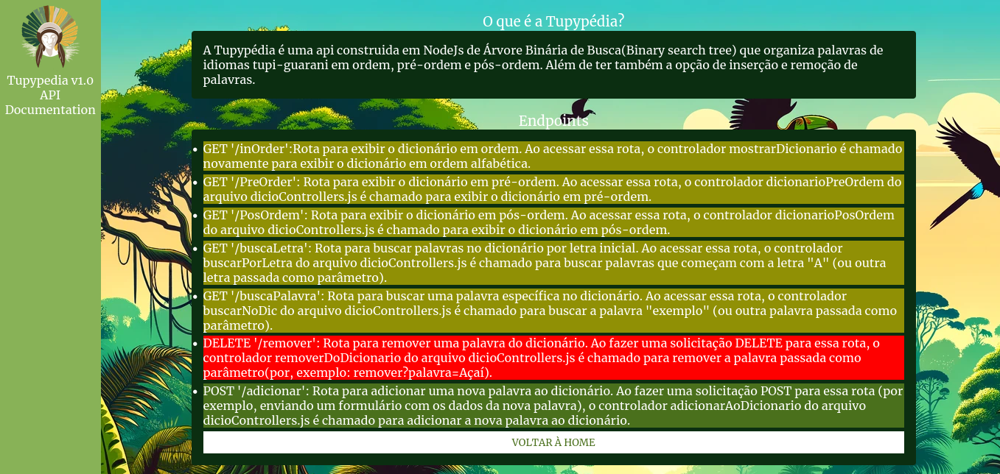
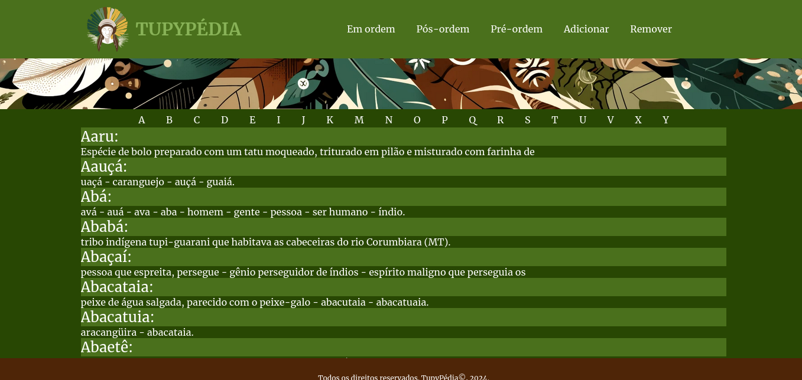
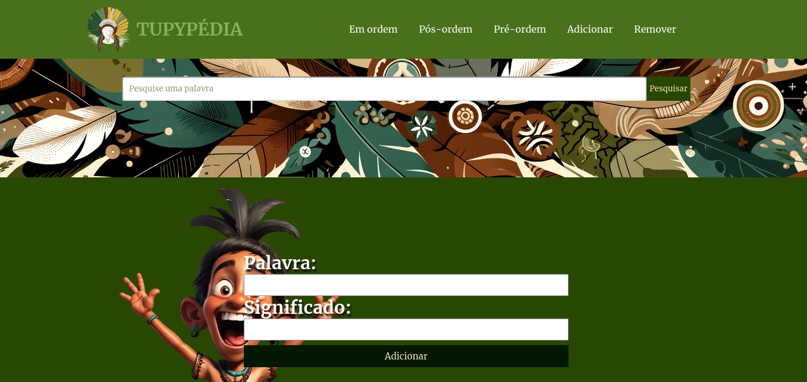

# TUPYPÉDIA
Api NodeJs/ExpressJs de dicionário Tupi-guarani.

### COMO USAR
- Verifique se seu computador tem uma versão igual ao superior a versão 18 do NodeJs;
- Clone este respositório;
- Abra o a pasta raiz do repositório;
- Execute o comando `npm install` para instalar as depêndencias do projeto;
- Abra o projeto na url que aparecerá no terminal.

Ou se preferir, poderá acessar o projeto através do link: https://tupy-pedia-1.onrender.com/
### TECNOLOGIAS USADAS

### DIAGRAMA DE FUNCIONAMENTO DA ROTAS DA API

### LAYOUT

Home

Docs

Dicionário

Adição de palavras

Remoção de palavras

### AUTORES:
Adelson Teodoro;
Arthur Duarte;
Savio Vitor;
Victor Ferraz.

